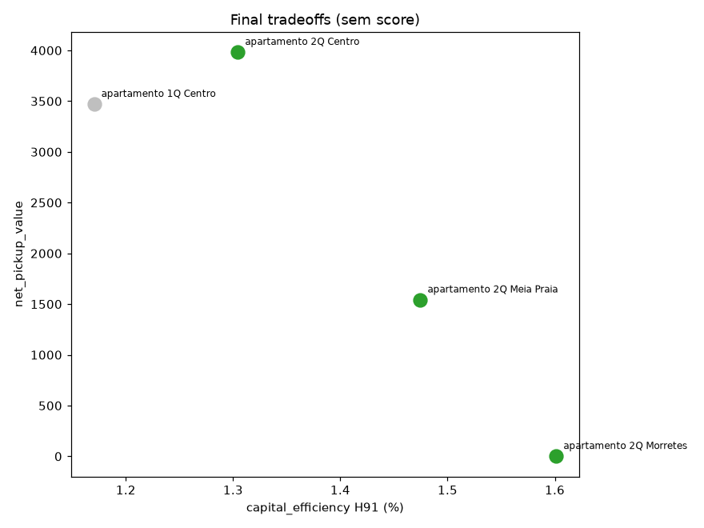
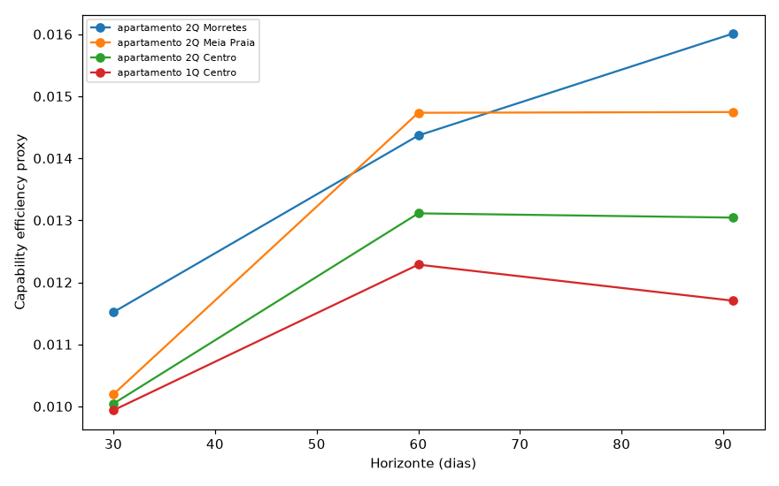
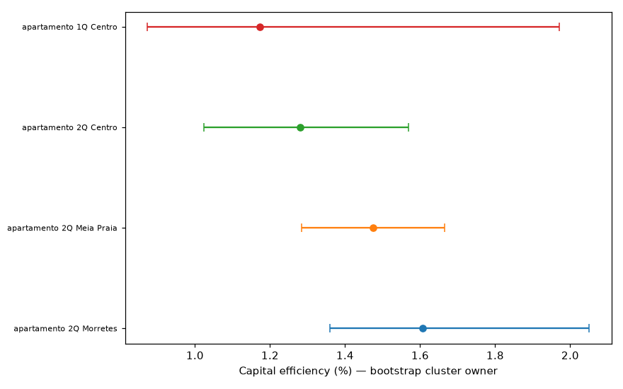

Vídeo: [LINK_GOOGLE_DRIVE_PENDENTE]
Transcrição: [LINK_GOOGLE_DRIVE_PENDENTE]

# Hackathon Jovens Talentos AI Builder 2026 — Recomendação de investimento em Itapema

## Recomendação executiva

**PRIMARY: Apartamento de 2 quartos em Meia Praia.**

Principais números auditados:

- N Airbnb = 126
- owners = 112
- 243 anúncios de venda no VivaReal
- preço mediano de compra ≈ R$1,08 milhão
- static revenue proxy H91 ≈ R$15.925
- observed-window capital efficiency proxy ≈ 1,47%
- pickup mediano ≈ R$1.541,92
- ranking H30 / H60 / H91 = 2º / 1º / 2º
- Pareto = não dominado

**Por que Meia Praia?**

Meia Praia não possui a maior eficiência isolada. Morretes 2Q tem eficiência maior (~1,60%) e preço menor, mas Meia Praia foi escolhida pela **convergência entre múltiplas perspectivas complementares**:

- performance estática (static revenue proxy),
- dinâmica temporal (pickup),
- robustez amostral (faixa amostral forte: 126 listings / 112 owners).

| Candidato | Preço mediano | eff H91 | pickup mediano | N Airbnb | owners | Papel |
|---|---|---|---|---|---|---|
| **Meia Praia 2Q** | R$1,08M | 1,47% | R$1.541,92 | 126 | 112 | **PRIMARY** |
| Morretes 2Q | R$790 mil | 1,60% | R$0 | 43 | 34 | ALT eficiência |
| Centro 2Q | R$1,15M | 1,30% | R$3.982,58 | 59 | 37 | ALT momentum |

## Respostas do desafio

### 1. Qual o melhor perfil de imóvel?

**Apartamento de 4 quartos.**

- N = 45
- static revenue proxy H91 mediana ≈ R$31.941
- ADR mediana ≈ R$874

Maior receita absoluta **não é** necessariamente o melhor investimento. O melhor perfil de *receita absoluta* (4 quartos) difere do perfil de *eficiência de capital* (2 quartos). Não confundir os dois critérios.

### 2. Qual a melhor localização em receita?

**Meia Praia**, para a static revenue proxy:

- H30 ≈ R$12.874
- H60 ≈ R$18.850
- H91 ≈ R$19.200

Também observamos que o **Centro** apresenta a maior intensidade de *pickup* mediano por listing entre os principais bairros — a dinâmica de demanda (momentum). Não confundir **bairro Centro** com o segmento **Centro 2Q**; são níveis de análise diferentes.

### 3. Quais características estão associadas à melhor receita?

Separando por dimensão:

- **ADR** (preço anunciado): associado a quartos, banheiros, hóspedes, cleaning fee e camas (estrutura/capacidade do imóvel).
- **Unavailability proxy** (proxy de demanda): associado a reviews, número de fotos e maturidade do host.
- **Static revenue**: estrutura/capacidade apresenta associação positiva com o ADR e com a proxy estática observada.

Usamos sempre "associado a" — nunca "causa", "aumenta" ou "move a demanda" — porque a relação é descritiva/associativa.

**Descoberta metodológica:** o GroupKFold por owner mostrou que o Random Forest **não generaliza bem** a static revenue para hosts não vistos. Portanto, a análise de drivers é predominantemente descritiva/associativa, e **não** prova causalidade nem serve como modelo preditivo forte.

### 4. O que comprar hoje?

- **PRIMARY:** Apartamento 2Q em Meia Praia — melhor equilíbrio entre eficiência, dinâmica e robustez amostral.
- **ALTERNATIVE_1:** Apartamento 2Q em Morretes — alternativa de eficiência / value (maior cap_eff ~1,60%, menor preço).
- **ALTERNATIVE_2:** Apartamento 2Q no Centro — alternativa de momentum (pickup mais alto).

## Teste da tese interna

### Studio no Centro

**INCONCLUSIVO POR EVIDÊNCIA INSUFICIENTE.**

- 3 listings no Details
- 0 com Price_AV

Não há dados de preço suficientes para sustentar ou rejeitar a tese do studio. Não dizemos "sustentado", "rejeitado" nem "ruim".

### Apartamento 1Q no Centro

**NÃO SUSTENTADO COMO ALTERNATIVA DE MAIOR EFICIÊNCIA DE CAPITAL.**

- A favor: cobertura Price_AV snapshot ≈64,7%; pickup mediano ≈R$3.469,96; preço ≈R$890 mil (inferior a Meia2 e Centro2).
- Contra: 4º em H30/H60/H91; capital efficiency ≈1,17%; Pareto dominado; N venda = 22; apenas 17 owners H91; pickup inferior ao Centro2.

## Como medir performance sem inventar receita

Definições (todas são **proxy**, nunca receita/ocupação realizada):

- **static_revenue_proxy_H** = `median_available_price_H × unavailable_nights_H`
- **capital_efficiency_proxy** = `static_revenue_proxy / median_asking_sale_price`

Interpretação do Price_AV:

- uma linha observada = data com preço;
- ausência dentro da janela interpretada como indisponibilidade;
- indisponibilidade **não** é reserva confirmada (pode ser bloqueio, manutenção ou uso do proprietário);
- logo, não é receita realizada.

- Não é ROI anual nem yield anual. **Não anualizamos** (janela observada cobre verão/início do ano).
- **Pickup** = mudança de disponível → indisponível entre capturas, valorizada pelo preço observado; **não é** reserva confirmada.

## Metodologia (resumo)

1. Auditoria dos 5 datasets.
2. Hosts canonicalizado por `owner_id` (último snapshot).
3. Mesh como fonte de bairro.
4. Price_AV agrupado por `capture_day`.
5. Snapshot principal 20/01.
6. Horizontes H30 / H60 / H91.
7. static revenue proxy.
8. pickup 06/01 → 20/01.
9. VivaReal deduplicado e bairros canonicalizados.
10. Join conceitual bairro × quartos × tipo.
11. Capital efficiency.
12. Bootstrap cluster por owner.
13. Sensibilidade.
14. Pareto.
15. Drivers.
16. GroupKFold por owner.
17. Red-team.

Detalhamento completo em [`relatorio.md`](relatorio.md).

## Limitações

- Semântica do Price_AV é inferida (proxy).
- **Indisponível ≠ reserva**.
- **Selection bias**: cobertura do Price_AV difere entre segmentos; Meia Praia 2Q ≈17,4%.
- Janela concentrada em verão/início do ano; **nenhuma anualização**.
- Preço VivaReal é **asking price**, não transação.
- Custos operacionais completos não observados.
- Airbnb e VivaReal **não são o mesmo imóvel** (join conceitual).
- Dependência entre listings do mesmo host.
- Tamanhos amostrais diferentes entre segmentos.
- static revenue é **proxy**, não receita realizada.

## Figuras

### Trade-offs dos candidatos



### Sensibilidade por horizonte



### Incerteza bootstrap



## Como reproduzir

```powershell
python -m venv .venv
.\.venv\Scripts\Activate.ps1
pip install -r requirements.txt
```

```bash
python src/01_data_audit.py
python src/02_airbnb_metrics.py
python src/03_investment_analysis.py
python src/04_revenue_drivers.py
python src/05_sensitivity_redteam.py
python src/06_final_recommendation.py
python src/99_validate_final_artifacts.py
```

`data/` não é modificado em nenhum script.

## Uso de IA

- **OpenCode**: implementação e execução dos scripts.
- **ChatGPT**: metodologia, auditoria independente e red-team.
- **Humano**: decisão, crítica, revisão e aprovação.

Houve erros metodológicos e de implementação; foram detectados, questionados e corrigidos. Logs completos das sessões estão disponíveis em [`ai-log/`](ai-log/). A IA **não** tomou a decisão sozinha — a decisão final é do autor do projeto.